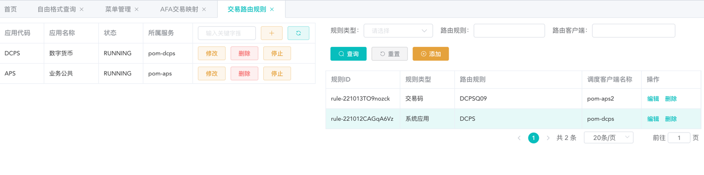

### 和 afa 通讯配置说明

> 支持 http、https 和 sdk 调用方式


#### 配置步骤

+ ##### pom-aps 模块配置 client

  配置示例
  > 下面配置中提供了三种调用方式的使用配置。pom-aps完整引入了sdk、feign请求的所有依赖，尽管多数市场不使用sdk调用。公司版本sdk的maven引入太重，且存在依赖缺失和多余错误内容引入，

```
remote:
  # 允许找不到指定name的client时使用默认的client发送请求
  allow-default-invoke: true
  clients:
    # 全局唯一
    - client-name: pom-dcps
      # 是否默认
      default: true
      # 调度类型，FEIGN/SDK
      dispatch-type: FEIGN
      feign:
        protocol: http
        context-path: /
        connect-timeout: 3000
        read-timeout: 30000
        list-of-servers: 127.0.0.1:8901, 127.0.0.1:8902
    - client-name: pom-aps
      dispatch-type: SDK
      sdk:
        protocol: abus
        eureka: 192.168.71.123:8761
        async: false
        use-long: true
        current-service-name: pom
        current-service-version: 1.0
        retry-same-count: 0
        retry-next-count: 0
    - client-name: pom-aps2
      dispatch-type: FEIGN
      feign:
        protocol: https
        context-path: /
        connect-timeout: 3000
        read-timeout: 30000
        list-of-servers: 192.9.200.71:10015
        ssl:
          alias: test
          password: 123456
          certificate-path: afe.keystore
          # JKS/JCEKS/PKCS12/BKS/UBER
          key-store-type: JKS
  message:
    default-config: default
    config:
      default:
        charset: UTF-8
        legal-empty-result-code: FAPD504, FAPD001
        success-result-code: A000000
  router:
    rule:
      app:
        strategy: redis
      tradeCode:
        strategy: redis

eureka:
  client:
    register-with-eureka: false
    fetch-registry: false
```

说明：
+ ###### eureka.client配置
由于sdk必须使用eureka discovery加载afa服务信息，但是管理端为单机版本，无注册中心，不特殊处理的情况，不影响使用但会一直刷新error日志。  
解决方案1（当前采纳），关闭eureka的register，方案2：把管理端作为一个服务注册到afa的eureka server
+ ###### client-name
必须保持全局唯一，且以[pom-]开头。多活情况，通讯模块做了软负载，扩展了feign和spring-load-balancer，根据prefix内容确定是否使用自定义的client内容。
+ ###### rule
路由规则相关，可配置匹配数据源策略，redis、jpa和yml，默认yml。发送afa的请求，会根据交易码和所属系统进行路由调度，匹配规则来源有redis、jpa和yml，无特殊情况请采用redis。
+ ###### list-of-servers
如果多台afe，根据示例配置即可

+ ###### 其他
其他内容
---


+ ##### https请求密钥文件生成
    提供一个证书生成命令，具体afa协调
    ```
    keytool -genkey -v -keystore afe.keystore -alias agree_afe_pom -storepass Agree@2022 -keypass Agree@2022 -keyalg RSA -validity 3650
    ```

+ ##### 管理端交易路由规则


  + ###### 系统应用