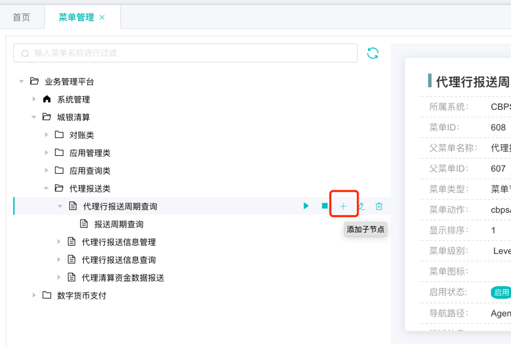
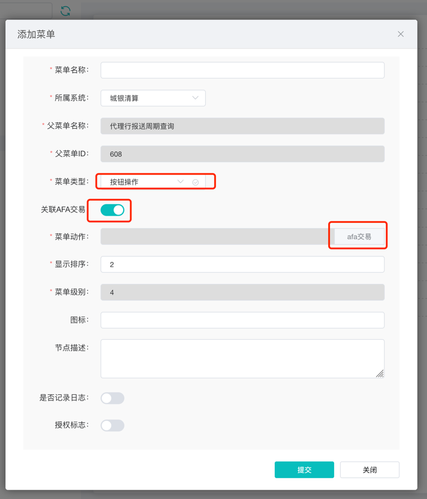

#### mock的使用


#### 增加交易接口
+ ##### 1、新增AFA交易映射
  使用平台运维类型的用户登录，顶部导航栏【应用管理/AFA交易管理】新增一个AFA交易映射
  + 交易码内部保持唯一即可，最好保持具有意义即可，如CBP001
  + 应用所属系统必须选择正确
  + 报文类型有三种
    + QUERY：标识是前端上送page分页信息，后台返回数据有ResultList标签
    + SEND：无page分页信息，返回数据在返回报文的body中（如报送申请、详情查询）
    + FILE：当前未启用
+ ##### 2、增加按钮类型的菜单
  > 系统任何和后台交互的请求都要配置权限
  平台运维类型用户登录，左侧菜单【系统管理/菜单管理】，找到交易名称，新增子菜单
  + 菜单名称随意，用于识别
  + 菜单类型为3-操作按钮
  + 是否关联AFA交易，打开
  + 菜单动作中选中上一步新增的交易映射
  
  
  

+ ##### 3、勾选角色
  角色管理中找到指定角色，下一步后勾选中新增的菜单按钮

+ ##### 4、代码详情开发
  + template增加dialog，变量自行添加
  ```
    <el-dialog title="代理行报送信息详情" :visible.sync="detailVisible" width="70%" v-dialogDrag>
      <ExDescribe :datalist="detailList" :dataobject="detailObject" :cols="3" :labelWidth="detailLabelWidth" :maxHeight="700"></ExDescribe>
      <span slot="footer" class="dialog-footer">
        <el-button @click="detailVisible = false" type="primary" plain>关 闭</el-button>
      </span>
    </el-dialog>
  ```
  + 详情数据填充
    目前多数情况都是table中选择一条，把该条数据的所有列都展示在详情中。如果有其他需求，如需要经过后台afa查询的，无非就是detailObject来源的问题
    ```
     openDetail(row = {}) {
      const submitData = {
        workdate: row.workdate,
        agentserialno: row.agentserialno
      }
      // 仅示例，第一步配置的
      dispatch('CBP9999', submitData).then(result => {
        const { data } = result

        this.detailObject = Object.assign({},  data)
      })
    }

    ```

  + 
  