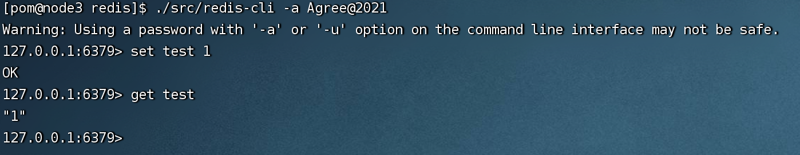
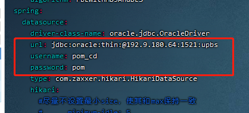
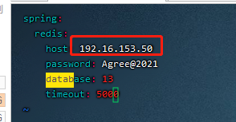
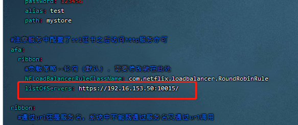
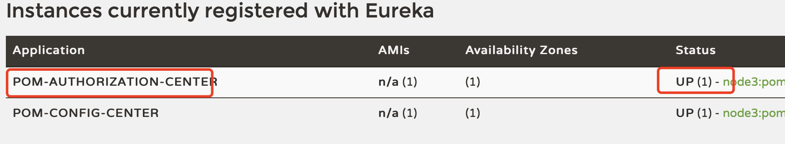

__开发时，在服务器搭建一套后端，所有开发人员直连，仅需在本地开发前端__

资源在文档最下方的资源列表中

### 部署步骤
> #### 1. 创建服务器用户pom并设置密码
   ```
    sudo groupadd pom
    sudo useradd pom -g pom -d /home/pom
    sudo passwd pom
   ```
> #### 2. 修改host
   ```
   vi /etc/hosts
   
   // 增加映射 
   本机ip pom-service
   ```
> #### 3. 数据库客户端执行sql
   1. pom-create.sql
   2. pom-init.sql  

> #### 4. redis部署
##### 1） 上传redis.tar资源到服务器目录并解压
##### 2） 执行：cd /home/pom/redis/
##### 3） 执行: ./src/redis-server ./redis.conf
##### 4） 验证
+ ps -ef|grep redis 检查应用是否启动
+ 执行redis存取命令 
  + 执行： cd /home/pom/redis/
  + 执行：./src/redis-cli -a Agree@2021
    

> #### 5. nginx部署
##### 1） 上传nginx.tar资源到服务器目录并解压
##### 2） 修改nginx的配置 vi /home/pom/nginx/conf/nginx.conf
+ 修改里面的ip为后台服务器地址（共3处） 

##### 3） 启动nginx
  + cd /home/pom/nginx
  + ./sbin/nginx -c ./conf/nginx.conf

##### 4） 验证
```
curl -X get http://ip:7009

// 获取到一个404页面即成功（尚未部署前端资源）
```

> #### 6. 应用代码资源上传和部署
##### 1）上传pacakge.zip到/home/pom/resource/ui后执行解压（如果没有该目录请自行创建）
##### 2）重载nginx
+ cd /home/pom/nginx
+ ./sbin/nginx -s reload
##### 3）上传所有jar文件和config-resource文件夹到服务器目录/home/pom/resource/pom

> #### 7. 后端配置文件修改

__以下配置文件父目录：/home/pom/resource/pom/config__  

| 配置 | 文件路径 | 修改内容 | 示例图表 |
|   ----  | ---- | ---- | ---- |
| 数据库配置 | default/database-pro.yml | url，用户名，密码 |  |
| redis配置 | default/redis-pro.yml | host地址 |  |
| afe通讯地址 | business/pom-ibps-pro.yml business/pom-aps-pro.yml等 | listOfServers，修改为内联afe地址 |   |

> #### 8. springboot应用启动

__以下操作目录：/home/pom/resource/pom__  
此处不提供一键启停脚本，分步执行，每一步都可以快速验证结果

| 服务模块 | 命令 | 验证操作 | 预期验证结果 |
|   ----  | ---- | ---- | ---- |
| 注册中心 | nohup java -Xmx128m -jar pom-eureka-2.7.0.jar & | 浏览器登录http://ip:9701查看 | 可以正常打开 |
| 配置中心 | nohup java -Xmx128m -jar pom-config-center-2.7.0.jar & ｜ 浏览器登录http://ip:9702/database-pro.yml（用户名密码：ylife/ylife87）| 检查数据库配置是否正常 |
| 授权认证中心 | nohup java -Xmx256m -jar pom-authorization-center-2.7.0.jar --spring.profiles.active=pro & | 浏览器登录http://ip:9701查看 |  |
| 平台服务 | nohup java -Xmx378m -jar pom-system-service-2.7.0.jar --spring.profiles.active=pro & | 同上方案 | 存在POM-SYSTEM-SERVICE服务 | 
| 业务服务 | nohup java -Xmx128m -jar **pom-cups-2.7.0.jar** --spring.profiles.active=pro & | jar包名根据各市场需要 | 存在POM-CUPS服务 |
| 网关 | nohup java -Xmx128m -jar pom-gateway-2.7.0.jar --spring.profiles.active=pro & | 同上方案 | 存在POM-GATEWAY服务 |