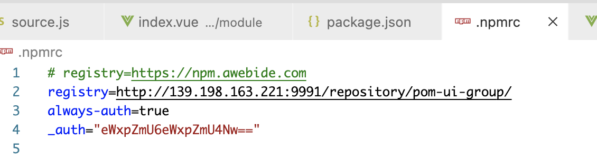

### 开发说明

## 开发环境
#### 后端
+ JDK1.8
+ MAVEN3.6.x
+ 工具：idea社区版

#### 前端
+ nodejs14.x或15.x
+ npm建议6.x
+ 工具：vscode

## 内网环境
### 1、有私服
> 其中前端插件@v2-lib/vue.spa.plugin和后端asdk相关依赖都是公司内部资源，在本页面最下面提供下载目录并参考内部插件安装步骤

+ #### 前端配置
项目根目录.npmrc中registry


+ #### maven配置

1、项目pom-parent模块中pom.xml中配置

```
 <distributionManagement>
    <repository>
        <id>qingcloud-releases</id>
        <url>http://139.198.163.221:9991/repository/maven-releases/</url>
    </repository>

    <snapshotRepository>
        <id>qingcloud-snapshots</id>
        <url>http://139.198.163.221:9991/repository/maven-snapshots/</url>
    </snapshotRepository>
</distributionManagement>
```
说明：id和项目中使用的maven的setting.xml中对应

2、maven的setting.xml
```
<server> 
    <id>qingcloud-releases</id>  
    <username>ylife</username>  
    <password>ylife87</password> 
</server>
<server>
    <id>qingcloud--snapshots</id>
    <username>ylife</username>
    <password>ylife87</password>
</server>
```

```
<mirror>
    <id>qingcloud-nexus</id>
    <mirrorOf>*</mirrorOf>
    <name>qingcloud-nexus</name>
    <url>http://139.198.163.221:9991/repository/maven-public/</url>
</mirror>
```

```
<profiles>
    <profile>
        <id>agree-repo</id>
        <activation>
        <activeByDefault>true</activeByDefault>
        <jdk>1.8</jdk>
        </activation>
        <properties>
        <maven.compiler.source>1.8</maven.compiler.source>
        <maven.compiler.target>1.8</maven.compiler.target>
        <maven.compiler.compilerVersion>1.8</maven.compiler.compilerVersion>
        </properties>
        <repositories>
        <repository>
            <id>qingcloud-nexus</id>
            <name>local-nexus</name>
            <url>http://139.198.163.221:9991/repository/maven-public/</url>
        </repository>
        </repositories>
        <pluginRepositories>
        <pluginRepository>
            <id>qingcloud-nexus</id>
            <name>qingcloud-nexus</name>
            <url>http://139.198.163.221:9991/repository/maven-public/</url>
        </pluginRepository>
        </pluginRepositories>
    </profile>
</profiles>
```

[示例setting.xml](micro/resource/setting.md)

### 2、无私服
> 可自行搭建私服，参照文档[nexus私服搭建](devops/nexus.md)，搭建后参照上一步进行配置。  
> 此处重点说明既无私服也无法搭建私服情况

+ ###### 前端
  请寻找一个和内网开发设备同样系统的电脑（windows版本和位数相同），连接互联网，下载依赖后将node_modules复制到内网（或者可以复制本地npm缓存内容，此处不提供具体步骤）
  > 无私服的情况可能在启动项目出现各种问题，多是系统版本和环境安装的问题。基本上无法提供援助，请自行查阅资料
+ ###### 后端
  联网的电脑即可，下载依赖后，将本地的maven repository复制到内网


#### 内部插件安装
+ 前端@v2-lib/vue.spa.plugin依赖，请从本页资源下载列表中下载，解压后复制到项目的node_modules后，重新执行npm install
+ 后端asdk，请从本页资源下载列表中下载，解压后放置到maven本地仓库目录下，更新idea的maven索引即可

## 前端项目启动
#### 前端package项目
1、执行npm install
2、修改src/api/source.js中的ip为部署的后台服务器地址
3、执行npm run serve即可


#### 资源
+ [@v2-lib/vue.spa.plugin](链接: https://pan.baidu.com/s/1IgzOpnWxr-ElpZZ1Mhyr_A 提取码: 1234)
+ [本地maven仓库](链接: https://pan.baidu.com/s/1vvssDlTndfvH-2xjnoVc7Q 提取码: 1234)
+ [单纯asdk仓库](链接: https://pan.baidu.com/s/1RwoYlWcYbT6ciRCLKMKfYg 提取码: 1234)
+ [文档说明](链接: https://pan.baidu.com/s/101aAF3dlH5SOBBXv7b1Q6Q 提取码: 1234)


