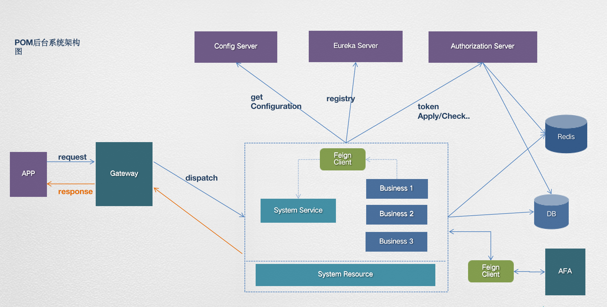

### 微服务架构的简单介绍
> 项目采用前后端分离模式  
> 前端：vue2.x 
> 后端：spring cloud（拥有独立的注册中心、配置中心、授权认证中心、网关等）

#### 1、后端项目架构

##### 服务模块
| 服务名称 | 中文名称 |
| :---- | :----     |
| pom-eureka | 注册中心|
| pom-config-center | 配置中心 |
| pom-authorization-center | 授权认证中心 |
| pom-system-service | 平台基础服务处理模块 |
| pom-gateway | 网关|
| pom-aps/pom-ibps ... | 业务模块 |

##### 流程描述
1、APP应用发送Restful请求达到网关Gateway  
2、网关根据请求URL信息分发应用到各服务模块，同时执行日志记录、权限校验等工作  
3、服务模块收到请求，率先从Request Header中获取Access Token发送到授权认证中心Authorization Center解析校验token，同时对执行权限进行验证  
4、服务模块处理请求。其中业务模块可通过HTTP、HTTPS和SDK和AFA进行通讯  
5、封装返回结果返回给APP应用  

#### 2、前端项目架构
在南研vue-sap-7.x版本基础上开发而来。提供了一系列适合管理端功能的扩展组件和功能，简单列举
+ 分页表格
+ 金额、日期、时间、枚举等filter和field组件
+ 详情表单
+ 结果页
+ excel导出
+ 请求和返回的拦截，全局异常处理
  
#### 3、设计说明
1、当前管理端不直接操作业务库，所有和业务相关的操作都透传到afa进行处理。  
2、管理端后台仅做一些权限、角色、用户管理等。微服务模式每新增一个业务系统，即需要在后台增加一个业务模块如pom-ibps、pom-cbps等后端需要增加一个maven module，同时网关配置路由规则。  
3、代码中可见，每一个业务模块仅有一个controller类，且不同模块代码都一致，未放入同一个模块的原因是考虑到各个系统的独立和特色要求，混合起来，处理比较麻烦（新版本
已经合并为一个）。  
4、在开发过程中，所有和后台有关的功能都只需要在页面进行配置，开发人员只需要关注前端vue文件。
