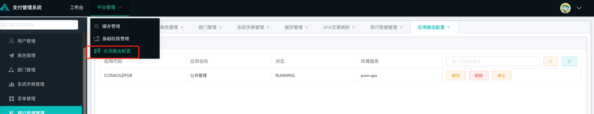

#### 增加应用/系统
> 如新增加数字货币、超级网银等应用  

1. 在应用管理中新增一个系统，填入应用代码，应用名称和所属服务。
> 注意：所属服务需要特殊设置，原则是使用pom-aps（当前对所属服务的配置要求未启用），除非后台单独增加了一个jar包服务，则改为jar包相应的application name
2. 薇薇薇薇

该功能详细说明：
+ 微服务版本每一个系统会有启用一个独立服务（jar文件），随着项目增加，多的情况已经有将近10个业务服务模块。每个jar资源大小在130Mb，内存设置最小128M，在低TPS的情况下过于浪费
