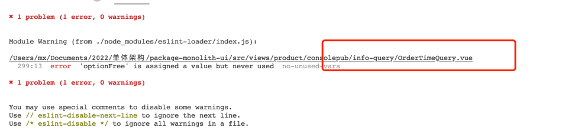

## 开发过程建议事项
+ ### 命名
  + 文件命名使用大驼峰
  + 文件夹命名使用横杠隔开
  + 子组件命名、变量命名要准确、枚举命名请按照统一标准（利于他人阅读代码）
    + 变量命名要有正确含义，多数情况下可有替代注释的作用
    + 枚举命名请采纳统一标准：propertyName + 'Store'
    
  + copy页面后，需要修改ID、tableRef等
    > 使用页面内replace all，避免遗漏
    

+ ### 引用路径
  + 公共js、组件使用@开始的绝对路径
  ```
    import { dispatch } from '@/api/api-aps'
    
    import BankInfoQuery from '@/views/components/BankInfoQuery'
  ```
  + 子组件和支持帮助工具类使用相对路径
  ```
    import AddComponent from './AddComponent'
    import UpdateComponent from './common/UpdateComponent'
  
    import { helpUtil } from './utils/help'
  ```

+ ### () => 箭头函数的合理使用
  > vue中箭头函数中this的指向不一样

  存量代码中，有诸多使用不恰当的地方，比如声明一个全局的_this，或者在mounted生命周期内生命_this，此举好处是使用不会出现错误，但释放不及时可能造成
内存泄漏等。新版本要求，避免这种全局变量的声明，使用箭头函数可替代（具体使用请自行查询资料或者比对目前代码）

+ ### 组件宽度
  > 宽度要恰当，能够满足最大数据长度即可，节约页面资源
  + table中列宽度
    
  + form的label和value宽度
      

+ ### eslint
  > 项目中引入了eslint，项目提交前请检查不合适的地方并修复。（不建议使用npm run lint修复全部）
  
  项目执行了npm run serve后，文件修改保存后会执行eslint检查
   
  可看到不合规范的地方，点击进去，找到所有的待fix点，执行自动或者手动修复
  
  
+ ### 提示消息使用
  + form输入框不合法，使用rule可显示校验异常消息
    + 前端中逻辑判断，用于提示用户
    ```
     this.$message.error
    ```
    
  + 页面交互式（不和后台交互）
    
  + 和后台交互
    ```
     this.$notify.success
    ```
    